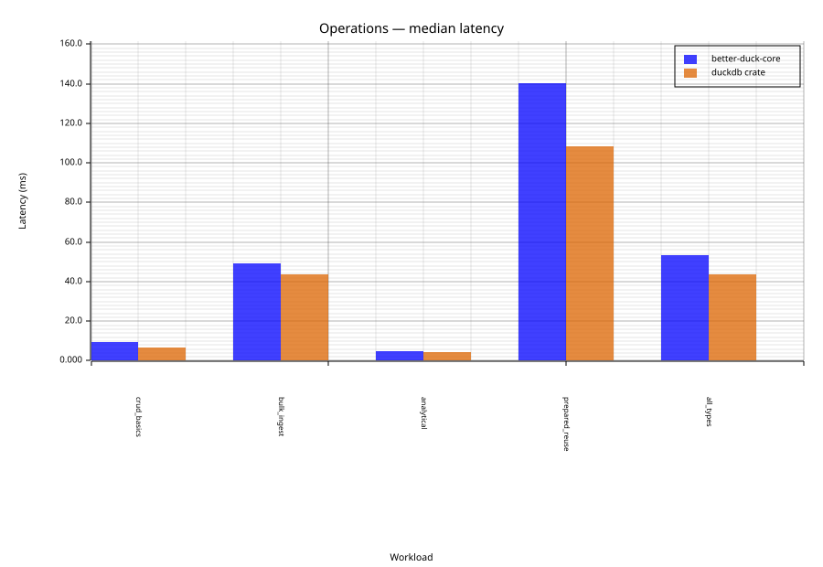
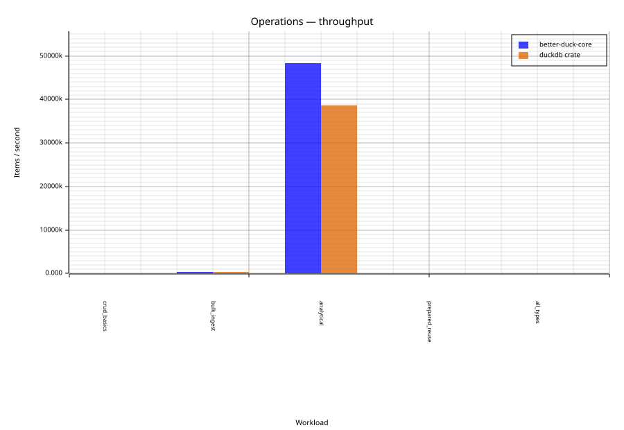

# better-duck

**A safe, embedded-first Rust client for [DuckDB](https://duckdb.org), with an optional [Diesel 2.3](https://diesel.rs) ORM backend.**

[](https://github.com/nimdeveloper/better-duck/actions/workflows/ci.yml)
[](https://crates.io/crates/better-duck-core)
[](https://docs.rs/better-duck-core)
[](#license)
[](#supported-platforms)

> [!WARNING]
> **Beta** — the API is settling. Breaking changes before `1.0` are possible; check the [changelog](CHANGELOG.md) before upgrading.

---

## Why better-duck?

Most Rust DuckDB bindings depend on Arrow or require a system-installed DuckDB library. `better-duck` takes a different approach:

- **Bundled DuckDB** — can ship with the DuckDB C library compiled in; no system package needed.
- **No Arrow dependency** — columnar I/O is great for data pipelines, but most app-level OLAP code just needs rows. We skip the Arrow overhead entirely.
- **Diesel ORM** — the `better-duck-diesel` crate is a full Diesel 2.3 backend, so your existing `table!` / query DSL code works without changes.
- **Embedded-first** — designed to run inside Tauri desktop apps, iOS cross-builds, and other environments where you can't rely on a system library.
- **Safe public API** — every FFI call is wrapped; nothing `unsafe` leaks into user code.

---

## Crates

| Crate | crates.io | Description |
|---|---|---|
| `better-duck-core` | [](https://crates.io/crates/better-duck-core) | Low-level DuckDB wrapper — connections, prepared statements, bulk appender, full type coverage |
| `better-duck-diesel` | [](https://crates.io/crates/better-duck-diesel) | Diesel 2.3 backend — full query DSL, migrations, r2d2 connection pool |

---

## Quick start

```toml
[dependencies]
# Core only
better-duck-core = "0.1.0-beta.3"

# Or: Core + Diesel ORM backend
better-duck-core   = "0.1.0-beta.3"
better-duck-diesel = "0.1.0-beta.3"
```

> [!NOTE]
> Cargo's default version requirement (e.g. `"0.1"`) excludes pre-release versions like
> `-beta.3` — pin the exact pre-release version as shown above, or run
> `cargo add better-duck-core --version 0.1.0-beta.3`.

---

## `better-duck-core`

A low-level, no-ORM DuckDB wrapper that gives you direct access to connections, prepared statements, the bulk appender, and the full `DuckValue` type hierarchy — without pulling in an ORM.

### Opening a connection

```rust
use better_duck_core::connection::Connection;

// in-memory (great for tests and one-shot scripts)
let mut conn = Connection::open_in_memory()?;

// on-disk file
let mut conn = Connection::open("my_database.duckdb")?;
```

### Execute and iterate rows

```rust
use better_duck_core::{connection::Connection, types::value::DuckValue};

fn main() -> better_duck_core::error::Result<()> {
    let mut conn = Connection::open_in_memory()?;

    conn.execute_batch(
        "CREATE TABLE events (id INTEGER, label TEXT, score DOUBLE);
         INSERT INTO events VALUES (1, 'alpha', 9.5), (2, 'beta', 7.2);",
    )?;

    let mut result = conn.execute("SELECT id, label, score FROM events ORDER BY id")?;
    for row in result {
        let row = row?;
        println!(
            "id={:?}  label={:?}  score={:?}",
            row.get("id"),
            row.get("label"),
            row.get("score"),
        );
    }
    Ok(())
}
```

### Parameterized queries

Parameters are positional (`$1`, `$2`, …) and passed as `&mut [&mut dyn AppendAble]`:

```rust
use better_duck_core::types::value::DuckValue;

let mut threshold = DuckValue::Double(8.0);
let mut rows = conn.execute_with(
    "SELECT id, label FROM events WHERE score > $1",
    &mut [&mut threshold],
)?;
for row in rows {
    let row = row?;
    println!("{:?}", row);
}
```

### Bulk insert with the Appender

The `Appender` streams rows directly into DuckDB's bulk-ingest path — much faster than individual INSERTs for large datasets:

```rust
use better_duck_core::{connection::Connection, types::appendable::AppendAble};
use better_duck_core::ffi::{duckdb_appender, duckdb_prepared_statement, duckdb_append_int32, duckdb_bind_int32};
use better_duck_core::error::Result;

struct IntRow(i32);

impl AppendAble for IntRow {
    fn appender_append(&mut self, appender: duckdb_appender) -> Result<()> {
        // SAFETY: appender is valid and the table has one INTEGER column.
        unsafe { duckdb_append_int32(appender, self.0) };
        Ok(())
    }
    fn stmt_append(&mut self, idx: u64, stmt: duckdb_prepared_statement) -> Result<()> {
        // SAFETY: stmt is valid; idx is a 1-based parameter index.
        unsafe { duckdb_bind_int32(stmt, idx, self.0) };
        Ok(())
    }
}

let mut conn = Connection::open_in_memory()?;
conn.execute_batch("CREATE TABLE nums (v INTEGER)")?;

let mut app = conn.appender("nums", "main")?;
for i in 0..10_000i32 {
    app.append(&mut IntRow(i))?;
}
app.save()?; // flush to DuckDB
```

The appender auto-flushes on drop (errors go to stderr); call `.save()` explicitly if you want to handle flush errors.

### Sharing a database, pooling, and async

`Connection::open_in_memory()` gives each connection its own independent in-memory
database. To share one database across multiple connections — including in-memory
ones — open a `Database` and `connect()` from it:

```rust
use better_duck_core::database::Database;

let db = Database::open_in_memory()?;
let mut a = db.connect()?;
let mut b = db.connect()?;
a.execute_batch("CREATE TABLE t (id INTEGER)")?;
b.execute_batch("INSERT INTO t VALUES (1)")?; // b sees a's table
```

With the `pool` feature, `Database` backs an `r2d2` connection pool:

```rust
use better_duck_core::pool::{DuckDbConnectionManager, Pool};

let manager = DuckDbConnectionManager::memory()?;
let pool = Pool::builder().max_size(8).build(manager)?;
let mut conn = pool.get()?;
```

With the `async` feature, `AsyncConnection` wraps a `Connection` behind
`tokio::task::spawn_blocking`, so it never blocks the async executor:

```rust
use better_duck_core::AsyncConnection;

let conn = AsyncConnection::open_in_memory().await?;
conn.execute_batch("CREATE TABLE t (id INTEGER)").await?;
let result = conn.execute("SELECT * FROM t").await?; // returns a ResultSet
```

`async` + `pool` together enable `AsyncPool`, whose `with()` method checks a
connection out and runs a closure on a blocking thread, matching the pattern used
for transactions (which must not span an `.await` point).

### `DuckValue` type hierarchy

Rows are yielded as `DuckRow`, and each column value is a `DuckValue`:

```rust
use better_duck_core::types::value::DuckValue;

match value {
    DuckValue::Int(n)     => println!("integer: {n}"),
    DuckValue::Text(s)    => println!("text: {s}"),
    DuckValue::Double(f)  => println!("float: {f}"),
    DuckValue::Null       => println!("null"),
    _ => println!("other: {value:?}"),
}
```

`DuckValue` is `#[non_exhaustive]` — match with `_` to stay forward-compatible as new types are added.

### Supported DuckDB types

| DuckDB type | Rust type |
|---|---|
| `BOOLEAN` | `bool` |
| `TINYINT` / `UTINYINT` | `i8` / `u8` |
| `SMALLINT` / `USMALLINT` | `i16` / `u16` |
| `INTEGER` / `UINTEGER` | `i32` / `u32` |
| `BIGINT` / `UBIGINT` | `i64` / `u64` |
| `HUGEINT` / `UHUGEINT` | `i128` / `u128` |
| `FLOAT` | `f32` |
| `DOUBLE` | `f64` |
| `DECIMAL` _(feature: decimal)_ | `rust_decimal::Decimal` |
| `VARCHAR` / `TEXT` | `String` |
| `BLOB` | `better_duck_core::types::blob::Blob` |
| `DATE` | `chrono::NaiveDate` _(chrono)_ / `DuckDate` |
| `TIME` | `chrono::NaiveTime` _(chrono)_ / `DuckTime` |
| `TIMESTAMP` | `chrono::NaiveDateTime` _(chrono)_ |
| `TIMESTAMPTZ` | `chrono::DateTime<Utc>` _(chrono)_ |
| `TIME_TZ` | `date_chrono::TimeTz` _(chrono)_ / `DuckTimeTz` — UTC offset fully preserved |
| `INTERVAL` | `chrono::Duration` _(chrono)_ / `std::time::Duration` |
| `LIST` / `ARRAY` | `Vec<DuckValue>` / `Box<[DuckValue]>` |
| `STRUCT` | `HashMap<String, DuckValue>` |
| `MAP` | `HashMap<DuckValue, DuckValue>` |
| `UNION` | `Box<DuckValue>` (active member; see roadmap for multi-arm write support) |
| `ENUM` | `String` |
| `UUID` | `better_duck_core::types::uuid::DuckUuid` |
| `BIT` | `better_duck_core::types::bit::DuckBit` |
| `BIGNUM` | `better_duck_core::types::bignum::DuckBignum` |

### User-defined functions _(feature: udf)_

Register plain Rust functions as DuckDB scalar or table functions with the
`#[duckdb_scalar]` / `#[duckdb_table_function]` attribute macros — no `unsafe`,
no manual vector handling. Parameter and return types are inferred from the
Rust signature.

```rust
use better_duck_core::{connection::Connection, duckdb_scalar, duckdb_table_function};

/// Scalar function: one value per row, usable in a SELECT list.
#[duckdb_scalar]
fn repeat_str(s: &str, n: i32) -> String {
    s.repeat(n.max(0) as usize)
}

/// Table function: rows and columns, usable in a FROM clause.
#[duckdb_table_function(name = "series", columns("n"))]
fn series(start: i64, stop: i64) -> impl Iterator<Item = i64> + Send {
    start..stop
}

let mut conn = Connection::open_in_memory()?;
repeat_str::register(&mut conn)?;
series::register(&mut conn)?;

conn.execute("SELECT repeat_str('ab', 3)")?;        // "ababab"
conn.execute("SELECT sum(n) FROM series(1, 101)")?;  // 5050
```

`Option<T>` parameters/returns propagate `NULL` explicitly; a `Result<T, E>`
return fails the query with `E`'s message. See the [`udf` module docs](https://docs.rs/better-duck-core)
for the full attribute reference and the panic-containment/`panic = "abort"` caveat.

---

## `better-duck-diesel`

A full [Diesel 2.3](https://diesel.rs) backend for DuckDB. Write normal Diesel DSL code against any DuckDB database — including in-memory, on-disk, and (soon) remote.

### Connecting

```rust
use better_duck_diesel::DuckDbConnection;
use diesel::prelude::*;

// in-memory
let mut conn = DuckDbConnection::establish(":memory:")?;

// on-disk file
let mut conn = DuckDbConnection::establish("/path/to/db.duckdb")?;

// with duckdb:// URL prefix (prefix is stripped)
let mut conn = DuckDbConnection::establish("duckdb:///path/to/db.duckdb")?;
```

### INSERT, SELECT, UPDATE, DELETE

```rust
use better_duck_diesel::DuckDbConnection;
use diesel::{connection::SimpleConnection, prelude::*};

diesel::table! {
    products (id) {
        id    -> Integer,
        name  -> Text,
        price -> Double,
    }
}

fn main() -> QueryResult<()> {
    let mut conn = DuckDbConnection::establish(":memory:")?;
    conn.batch_execute(
        "CREATE TABLE products (id INTEGER PRIMARY KEY, name VARCHAR NOT NULL, price DOUBLE NOT NULL)",
    )?;

    // INSERT with RETURNING
    let inserted: Vec<(i32, String)> = diesel::insert_into(products::table)
        .values(&vec![
            (products::id.eq(1), products::name.eq("widget"), products::price.eq(9.99)),
            (products::id.eq(2), products::name.eq("gadget"), products::price.eq(24.50)),
        ])
        .returning((products::id, products::name))
        .get_results(&mut conn)?;

    // SELECT with filter and ordering
    let cheap: Vec<(i32, String, f64)> = products::table
        .filter(products::price.lt(20.0))
        .order(products::name.asc())
        .select((products::id, products::name, products::price))
        .load(&mut conn)?;

    // UPDATE
    diesel::update(products::table.filter(products::id.eq(1)))
        .set(products::price.eq(11.99))
        .execute(&mut conn)?;

    // DELETE
    diesel::delete(products::table.filter(products::id.eq(2)))
        .execute(&mut conn)?;

    Ok(())
}
```

### Transactions

```rust
conn.transaction(|conn| {
    diesel::insert_into(products::table)
        .values((products::id.eq(3), products::name.eq("doohickey"), products::price.eq(4.99)))
        .execute(conn)?;
    // returning Err rolls back; Ok commits
    Ok(())
})?;
```

### DuckDB-specific SQL types

Use DuckDB types that don't have a standard Diesel equivalent by importing them via `sql_types`:

```rust
diesel::table! {
    use diesel::sql_types::*;
    use better_duck_diesel::sql_types::*;

    readings (id) {
        id       -> Integer,
        sensor   -> DuckEnum,          // DuckDB ENUM column
        value    -> Double,
        ts       -> DuckTimestamptz,   // TIMESTAMPTZ column
    }
}
```

### DuckDB ↔ Diesel ↔ Rust type mapping

**Standard Diesel types** (work out of the box):

| Diesel SQL type | DuckDB type | Rust type |
|---|---|---|
| `Bool` | `BOOLEAN` | `bool` |
| `SmallInt` | `SMALLINT` | `i16` |
| `Integer` | `INTEGER` | `i32` |
| `BigInt` | `BIGINT` | `i64` |
| `Float` | `FLOAT` | `f32` |
| `Double` | `DOUBLE` | `f64` |
| `Text` | `VARCHAR` | `String` |
| `Binary` | `BLOB` | `Vec<u8>` |
| `Date` | `DATE` | `chrono::NaiveDate` _(chrono)_ |
| `Time` | `TIME` | `chrono::NaiveTime` _(chrono)_ |
| `Timestamp` | `TIMESTAMP` | `chrono::NaiveDateTime` _(chrono)_ |
| `Numeric` | `DECIMAL` | `rust_decimal::Decimal` _(decimal)_ |

**DuckDB-specific types** (import via `better_duck_diesel::sql_types::*`):

| Diesel SQL type | DuckDB type | Rust type |
|---|---|---|
| `DuckTinyInt` | `TINYINT` | `i8` |
| `DuckUTinyInt` | `UTINYINT` | `u8` |
| `DuckUSmallInt` | `USMALLINT` | `u16` |
| `DuckUInt` | `UINTEGER` | `u32` |
| `DuckUBigInt` | `UBIGINT` | `u64` |
| `DuckHugeInt` | `HUGEINT` | `i128` |
| `DuckUHugeInt` | `UHUGEINT` | `u128` |
| `DuckTimestamptz` | `TIMESTAMPTZ` | `chrono::DateTime<Utc>` _(chrono)_ |
| `DuckInterval` | `INTERVAL` | `chrono::Duration` _(chrono)_ |
| `DuckTimeTz` | `TIME WITH TIME ZONE` | `CoreTimeTz` _(chrono)_ |
| `DuckTimeNs` | `TIME_NS` | `chrono::NaiveTime` _(chrono)_ |
| `DuckEnum` | `ENUM` | `String` |
| `DuckList` | `LIST` | `Vec<DuckValue>` |
| `DuckArray` | `ARRAY` | `Vec<DuckValue>` |
| `DuckStruct` | `STRUCT` | `HashMap<String, DuckValue>` |
| `DuckMap` | `MAP` | `HashMap<DuckValue, DuckValue>` |
| `DuckUnion` | `UNION` | `Box<DuckValue>` (active member) |
| `DuckUuid` | `UUID` | `better_duck_core::types::uuid::DuckUuid` |
| `DuckBit` | `BIT` | `better_duck_core::types::bit::DuckBit` |
| `DuckBignum` | `BIGNUM` | `better_duck_core::types::bignum::DuckBignum` |

> [!NOTE]
> Date/time types work either way: with the `chrono` feature they map to `chrono` types; without it, they map to `better_duck_core::types::date_native`'s plain structs and `std::time` types. Only one set is compiled at a time.

---

## Feature flags

### `better-duck-core`

| Feature | Default | Description |
|---|---|---|
| `bundled` | ✓ | Compile and embed the DuckDB C library (no system install needed) |
| `chrono` | ✓ | `chrono` date/time conversions for DATE, TIME, TIMESTAMP, TIMESTAMPTZ, INTERVAL |
| `decimal` | ✓ | `rust_decimal::Decimal` support for DECIMAL columns |
| `json` | — | Enable DuckDB's JSON extension (requires `bundled`) |
| `parquet` | — | Enable DuckDB's Parquet extension (requires `bundled`) |
| `buildtime_bindgen` | — | Regenerate FFI bindings at build time (requires LLVM/clang) |
| `async` | — | Tokio-based async facade (`AsyncConnection`, `AsyncDatabase`) over `spawn_blocking` |
| `pool` | — | `r2d2` connection pool backed by a shared `Database` handle |
| `udf` | — | `#[duckdb_scalar]` / `#[duckdb_table_function]` user-defined functions |

### `better-duck-diesel`

| Feature | Default | Description |
|---|---|---|
| `bundled` | ✓ | Forwards to `better-duck-core/bundled` |
| `decimal` | ✓ | Diesel `Numeric` ↔ `rust_decimal::Decimal` |
| `chrono` | — | Diesel date/time impls for DATE, TIME, TIMESTAMP, TIMESTAMPTZ, INTERVAL, TIME_TZ, TIME_NS |
| `r2d2` | — | r2d2 connection pool support via `diesel::r2d2` |

---

## Benchmarks

The workspace includes a benchmark harness at
[`crates/better-duck-core/benches/comparison.rs`](crates/better-duck-core/benches/comparison.rs)
that compares `better-duck-core` against the community [`duckdb`](https://crates.io/crates/duckdb)
crate, in-process (no subprocess overhead on either side), across primitive types, composite
types, and five representative operations. Run it with:

```sh
cargo bench -p better-duck-core --bench comparison
```

Results are written to [`docs/benchmarks/`](docs/benchmarks/): `REPORT.md` (full tables + charts),
`results.json` (raw numbers), and one latency/throughput SVG pair per group
(`comparison-primitive-types-*.svg`, `comparison-composite-types-*.svg`,
`comparison-operations-*.svg`).

**Sample results** (Operations group; see [`REPORT.md`](docs/benchmarks/REPORT.md) for the full
primitive- and composite-type tables):

| Workload | `better-duck-core` | `duckdb` crate |
|---|---|---|
| CRUD basics (4 ops) | 4.73 ms / 846 ops/s | 4.59 ms / 871 ops/s |
| Bulk ingest — 10k rows (appender) | 31.94 ms / 313.1 k rows/s | 38.55 ms / 259.4 k rows/s |
| Analytical GROUP BY — 100k rows | 4.19 ms / 23.9 M rows/s | 4.24 ms / 23.6 M rows/s |
| Prepared reuse — 100 queries | 75.72 ms / 1.3 k queries/s | 68.16 ms / 1.5 k queries/s |
| All-types scan — 1k rows, 11 cols | 32.91 ms / 30.4 k rows/s | 27.46 ms / 36.4 k rows/s |




Numbers move somewhat between runs due to normal system noise — the relative comparison within a
single run is what's meaningful, not absolute milliseconds across runs.

---

## Migrating from the community `duckdb` crate

| Operation | `duckdb` crate | `better-duck-core` |
|---|---|---|
| Open in-memory | `Connection::open_in_memory()?` | `Connection::open_in_memory()?` |
| Execute DDL | `conn.execute_batch(sql)?` | `conn.execute_batch(sql)?` |
| Insert / DML | `conn.execute(sql, [])?` | `conn.execute(sql)?.changes()` |
| SELECT rows | `conn.prepare(sql)?.query([])` | `conn.execute(sql)?` (is an `Iterator`) |
| Parameterized | `conn.execute(sql, params![v])?` | `conn.execute_with(sql, &mut [&mut v])?` |
| Bulk insert | `conn.appender(table)?` | `conn.appender(table, schema)?` |

---

## Supported platforms

| Platform | Status |
|---|---|
| Linux x86_64 | ✓ CI-tested |
| macOS Apple Silicon (aarch64) | ✓ CI-tested |
| macOS x86_64 | ✓ CI-tested |
| Windows x86_64 | ✓ CI-tested |
| iOS aarch64 | ✓ CI cross-build |
| iOS Simulator x86_64 | ✓ CI cross-build |

---

## Roadmap

The library is usable today for most workloads. Here's an honest list of what's still in progress — contributions are very welcome.

### Recently landed

- **New core types** — `UUID`, `BIT`, and `BIGNUM` are implemented end-to-end (core read/write +
  Diesel `FromSql`/`ToSql`). `GEOMETRY`, `VARIANT`, `ANY`, and `INTEGER_LITERAL` remain unsupported
  — the DuckDB C API has no value accessor for them (unlike the three above), so reading a column
  of these types still panics.
- **`TIME_TZ` timezone offset** — fully preserved on both read and write, in core and in Diesel.
- **Diesel `FromSql`/`ToSql` for composite types** — STRUCT, MAP, UNION, and ARRAY are implemented.
  UNION's Rust mirror is the active member's value only (see Mid-term below for multi-arm support).
- **Diesel date/time without `chrono`** — `date_native` is wired up; DATE/TIME/TIMESTAMP/INTERVAL/
  TIMESTAMPTZ/TIME_TZ/TIME_NS all work over Diesel without the `chrono` feature.
- **`DuckResult::exists()` and row cache** — `exists()` peeks without consuming the iterator;
  `rewind()` replays already-pulled rows.
- **`push_debug_binds`** — implemented; `debug_query`/`EXPLAIN` logging works.
- **Empty-collection type inference** — `Vec<T>`, `Box<[T]>`, and `HashMap<K, V>` convert to
  `LIST`/`ARRAY`/`MAP` using `T`'s (or `K`/`V`'s) static [`DuckLogicalType`], not by inspecting the
  first element — so they work even when empty, unlike the untyped `DuckValue::List`/`Array`/`Map`,
  which still can't infer an element type from zero entries.
- **`async` API** — `AsyncConnection`/`AsyncDatabase`/`AsyncPool` (feature `async`), a tokio-only
  facade over `spawn_blocking`.
- **Core-level connection pooling** — `Database` + `r2d2`-backed `Pool` (feature `pool`), which
  shares one database across every pooled connection (unlike opening N independent connections).
  `better-duck-diesel`'s own `r2d2` feature (via `diesel::r2d2::ConnectionManager`) is unaffected —
  both may be used side by side.
- **User-defined functions** (feature `udf`) — `#[duckdb_scalar]` and `#[duckdb_table_function]`
  register a plain Rust function as a DuckDB scalar or table function, with parameter/return types
  inferred from the Rust signature via `DuckLogicalType`. Backed by a new `better-duck-macros`
  proc-macro crate. Panics are caught and reported as query errors under `panic = "unwind"`; see the
  `udf` module docs for the `panic = "abort"` caveat. Named parameters, projection pushdown,
  `max_threads`, and `varargs` are not yet supported.
- **Query-path performance fixes** — `Decimal` binds no longer allocate a `String` per row;
  `u128`/UHUGEINT has a direct typed append/bind path (previously fell back to a slower generic
  one); every query execution no longer heap-allocates a throwaway `duckdb_result` box; and
  `DuckResult::count()` no longer materializes a `DuckRow` for rows it's about to discard. See the
  [benchmarks](#benchmarks) section and the changelog for details and before/after numbers.

### Mid-term

- **Diesel `prepare_for_cache` distinction** — DuckDB's C API has a single `duckdb_prepare` path
  with no unnamed/one-shot variant, so there is currently nothing to honour here; revisit if that
  changes upstream.
- **Multi-arm UNION write** — the current write path only builds single-member unions, and
  `DuckValue::Union` carries no tag or member names. Real multi-arm unions need a richer variant.
- **DECIMAL precision** — `decimal_value.width` is read but discarded; `DECIMAL(18,2)` round-trips
  to a different declared precision. Needs a `DuckValue::Decimal` shape change to carry width.
- **`RawConnection` panic-on-drop hardening** — a connection that fails to close panics in `Drop`;
  under `panic = "abort"` this aborts the process. Low risk today (`close()` always returns `Ok`),
  but worth hardening to log-and-continue, especially now that the pool multiplies the exposure.

### Exploratory / RFC

- **`better-duck-tauri` crate** — a Tauri plugin that wraps `better-duck-core` with auto-discovery of the app data directory, a repository/unit-of-work abstraction, and Tauri command bindings. Filed as an idea; design input welcome.
- **WASM / browser target** — DuckDB has a WASM build; exploring whether `better-duck-core` can compile to `wasm32-unknown-unknown` is on the list.

---

## Contributing

See [CONTRIBUTING.md](CONTRIBUTING.md) for the full guide — environment setup, git flow, commit conventions, how to add a new DuckDB type, and the PR checklist.

If you hit a bug or want to propose a feature, please [open an issue](https://github.com/nimdeveloper/better-duck/issues).

---

## License

Licensed under either of:

- [MIT License](LICENSE)
- [Apache License, Version 2.0](LICENSE-APACHE)

at your option.
