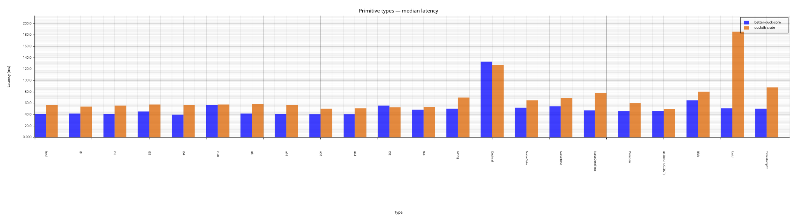
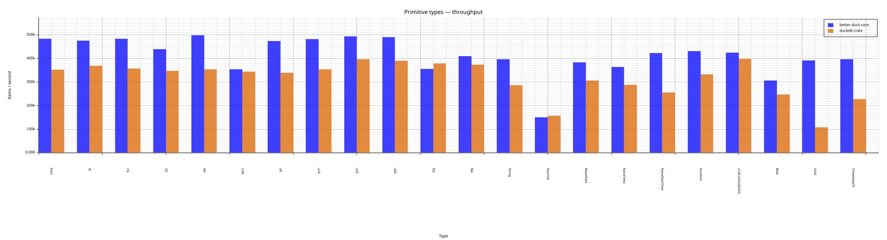
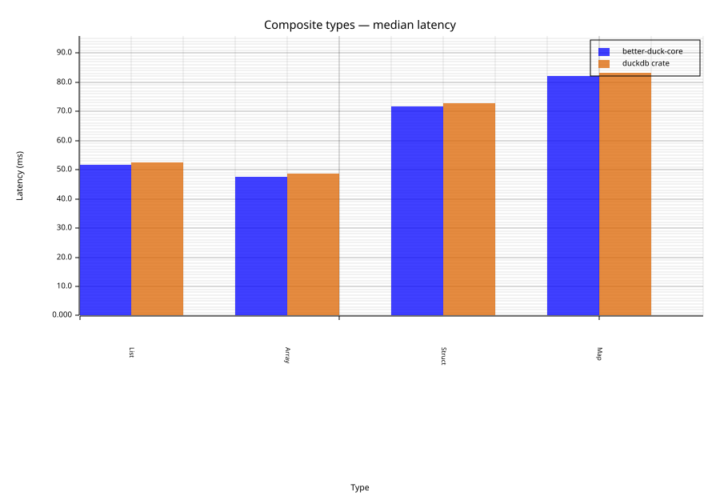
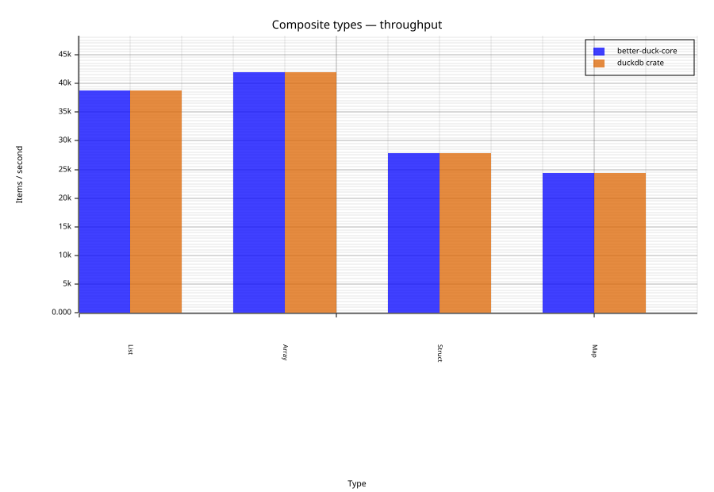

# better-duck-core vs `duckdb` crate — Benchmark Report

> **Latency** columns: min / median / p95 over the measured reps (warmup discarded).
> **Throughput** is `item_count / median_latency`.
> `better-duck-core` and the `duckdb` crate each vendor their own copy of DuckDB and cannot be linked into one process (see module docs), so each ran in its own process; timings are still directly comparable — both are in-process, native calls with no subprocess-per-operation overhead on either side.

## Primitive types

### bool — Insert + full-scan 20000 rows of BOOLEAN

*item\_count = 20000*

| Contender | Latency (min / median / p95) | Throughput |
|---|---|---|
| better-duck-core | 39.29 ms / 41.31 ms / 42.70 ms | 484.2 k/s |
| duckdb crate | 52.04 ms / 56.73 ms / 61.05 ms | 352.6 k/s |

### i8 — Insert + full-scan 20000 rows of TINYINT

*item\_count = 20000*

| Contender | Latency (min / median / p95) | Throughput |
|---|---|---|
| better-duck-core | 40.88 ms / 41.98 ms / 53.70 ms | 476.4 k/s |
| duckdb crate | 47.52 ms / 54.15 ms / 66.84 ms | 369.3 k/s |

### i16 — Insert + full-scan 20000 rows of SMALLINT

*item\_count = 20000*

| Contender | Latency (min / median / p95) | Throughput |
|---|---|---|
| better-duck-core | 40.38 ms / 41.38 ms / 45.23 ms | 483.3 k/s |
| duckdb crate | 51.13 ms / 55.92 ms / 59.52 ms | 357.6 k/s |

### i32 — Insert + full-scan 20000 rows of INTEGER

*item\_count = 20000*

| Contender | Latency (min / median / p95) | Throughput |
|---|---|---|
| better-duck-core | 39.69 ms / 45.52 ms / 48.50 ms | 439.4 k/s |
| duckdb crate | 51.33 ms / 57.65 ms / 62.61 ms | 346.9 k/s |

### i64 — Insert + full-scan 20000 rows of BIGINT

*item\_count = 20000*

| Contender | Latency (min / median / p95) | Throughput |
|---|---|---|
| better-duck-core | 38.22 ms / 40.10 ms / 43.33 ms | 498.8 k/s |
| duckdb crate | 53.77 ms / 56.46 ms / 59.26 ms | 354.2 k/s |

### i128 — Insert + full-scan 20000 rows of HUGEINT

*item\_count = 20000*

| Contender | Latency (min / median / p95) | Throughput |
|---|---|---|
| better-duck-core | 54.20 ms / 56.44 ms / 111.74 ms | 354.4 k/s |
| duckdb crate | 55.49 ms / 58.04 ms / 62.16 ms | 344.6 k/s |

### u8 — Insert + full-scan 20000 rows of UTINYINT

*item\_count = 20000*

| Contender | Latency (min / median / p95) | Throughput |
|---|---|---|
| better-duck-core | 37.91 ms / 42.20 ms / 52.95 ms | 474.0 k/s |
| duckdb crate | 49.67 ms / 58.95 ms / 61.96 ms | 339.2 k/s |

### u16 — Insert + full-scan 20000 rows of USMALLINT

*item\_count = 20000*

| Contender | Latency (min / median / p95) | Throughput |
|---|---|---|
| better-duck-core | 37.49 ms / 41.51 ms / 44.14 ms | 481.8 k/s |
| duckdb crate | 53.43 ms / 56.41 ms / 62.77 ms | 354.6 k/s |

### u32 — Insert + full-scan 20000 rows of UINTEGER

*item\_count = 20000*

| Contender | Latency (min / median / p95) | Throughput |
|---|---|---|
| better-duck-core | 38.95 ms / 40.48 ms / 42.48 ms | 494.1 k/s |
| duckdb crate | 49.09 ms / 50.37 ms / 52.63 ms | 397.1 k/s |

### u64 — Insert + full-scan 20000 rows of UBIGINT

*item\_count = 20000*

| Contender | Latency (min / median / p95) | Throughput |
|---|---|---|
| better-duck-core | 40.06 ms / 40.81 ms / 43.48 ms | 490.1 k/s |
| duckdb crate | 48.77 ms / 51.22 ms / 57.82 ms | 390.5 k/s |

### f32 — Insert + full-scan 20000 rows of FLOAT

*item\_count = 20000*

| Contender | Latency (min / median / p95) | Throughput |
|---|---|---|
| better-duck-core | 40.30 ms / 56.30 ms / 70.59 ms | 355.2 k/s |
| duckdb crate | 49.89 ms / 52.74 ms / 55.54 ms | 379.2 k/s |

### f64 — Insert + full-scan 20000 rows of DOUBLE

*item\_count = 20000*

| Contender | Latency (min / median / p95) | Throughput |
|---|---|---|
| better-duck-core | 42.85 ms / 48.83 ms / 69.89 ms | 409.5 k/s |
| duckdb crate | 51.16 ms / 53.53 ms / 59.76 ms | 373.6 k/s |

### String — Insert + full-scan 20000 rows of VARCHAR

*item\_count = 20000*

| Contender | Latency (min / median / p95) | Throughput |
|---|---|---|
| better-duck-core | 49.02 ms / 50.43 ms / 64.10 ms | 396.6 k/s |
| duckdb crate | 58.87 ms / 69.92 ms / 71.61 ms | 286.0 k/s |

### Decimal — Insert + full-scan 20000 rows of DECIMAL(18,4)

*item\_count = 20000*

| Contender | Latency (min / median / p95) | Throughput |
|---|---|---|
| better-duck-core | 100.82 ms / 133.09 ms / 181.91 ms | 150.3 k/s |
| duckdb crate | 121.38 ms / 127.30 ms / 140.57 ms | 157.1 k/s |

### NaiveDate — Insert + full-scan 20000 rows of DATE

*item\_count = 20000*

| Contender | Latency (min / median / p95) | Throughput |
|---|---|---|
| better-duck-core | 40.60 ms / 52.17 ms / 54.17 ms | 383.4 k/s |
| duckdb crate | 62.00 ms / 65.07 ms / 78.52 ms | 307.3 k/s |

### NaiveTime — Insert + full-scan 20000 rows of TIME

*item\_count = 20000*

| Contender | Latency (min / median / p95) | Throughput |
|---|---|---|
| better-duck-core | 47.53 ms / 54.97 ms / 131.78 ms | 363.9 k/s |
| duckdb crate | 65.08 ms / 69.41 ms / 74.35 ms | 288.1 k/s |

### NaiveDateTime — Insert + full-scan 20000 rows of TIMESTAMP

*item\_count = 20000*

| Contender | Latency (min / median / p95) | Throughput |
|---|---|---|
| better-duck-core | 43.53 ms / 47.30 ms / 50.80 ms | 422.8 k/s |
| duckdb crate | 71.83 ms / 78.29 ms / 106.54 ms | 255.5 k/s |

### Duration — Insert + full-scan 20000 rows of INTERVAL

*item\_count = 20000*

| Contender | Latency (min / median / p95) | Throughput |
|---|---|---|
| better-duck-core | 45.37 ms / 46.31 ms / 51.98 ms | 431.9 k/s |
| duckdb crate | 58.32 ms / 60.07 ms / 63.30 ms | 333.0 k/s |

### u128 (UHUGEINT) — Insert + full-scan 20000 rows of UHUGEINT

*item\_count = 20000*

| Contender | Latency (min / median / p95) | Throughput |
|---|---|---|
| better-duck-core | 45.65 ms / 47.03 ms / 49.82 ms | 425.3 k/s |
| duckdb crate | 48.63 ms / 50.09 ms / 52.49 ms | 399.3 k/s |

### Blob — Insert + full-scan 20000 rows of BLOB

*item\_count = 20000*

| Contender | Latency (min / median / p95) | Throughput |
|---|---|---|
| better-duck-core | 63.11 ms / 65.16 ms / 127.08 ms | 306.9 k/s |
| duckdb crate | 74.53 ms / 80.79 ms / 87.34 ms | 247.6 k/s |

### Uuid — Insert + full-scan 20000 rows of UUID

*item\_count = 20000*

| Contender | Latency (min / median / p95) | Throughput |
|---|---|---|
| better-duck-core | 46.33 ms / 50.95 ms / 55.25 ms | 392.6 k/s |
| duckdb crate | 170.92 ms / 185.80 ms / 198.76 ms | 107.6 k/s |

### TimestampTz — Insert + full-scan 20000 rows of TIMESTAMPTZ

*item\_count = 20000*

| Contender | Latency (min / median / p95) | Throughput |
|---|---|---|
| better-duck-core | 42.95 ms / 50.47 ms / 50.58 ms | 396.3 k/s |
| duckdb crate | 81.89 ms / 87.89 ms / 97.36 ms | 227.6 k/s |

## Composite types

### List — Insert + full-scan 2000 rows of INTEGER[] (LIST) — core: appender; duckdb crate has no write API for LIST, see `other_is_placeholder`

*item\_count = 2000*

> ⚠ The `duckdb` crate has no safe API for this operation. The row below is a **neutral placeholder** (`better-duck-core`'s latency + 1ms / throughput − 1), not a measurement — plotting the actual workaround's timing (a vectorized bulk SQL insert, a fundamentally different and much faster operation than a row-by-row appender) would make the comparison unfair. The real workaround timing is shown separately below for reference only.

| Contender | Latency (min / median / p95) | Throughput |
|---|---|---|
| better-duck-core | 45.63 ms / 51.61 ms / 57.00 ms | 38.8 k/s |
| duckdb crate (placeholder) | 46.63 ms / 52.61 ms / 58.00 ms | 38.8 k/s |

*Reference only — not used in the comparison above:*

| Contender | Latency (min / median / p95) | Throughput |
|---|---|---|
| duckdb crate (SQL-literal workaround) | 37.01 ms / 38.71 ms / 47.46 ms | 51.7 k/s |

### Array — Insert + full-scan 2000 rows of INTEGER[3] (ARRAY) — core: appender; duckdb crate has no write API for ARRAY, see `other_is_placeholder`

*item\_count = 2000*

> ⚠ The `duckdb` crate has no safe API for this operation. The row below is a **neutral placeholder** (`better-duck-core`'s latency + 1ms / throughput − 1), not a measurement — plotting the actual workaround's timing (a vectorized bulk SQL insert, a fundamentally different and much faster operation than a row-by-row appender) would make the comparison unfair. The real workaround timing is shown separately below for reference only.

| Contender | Latency (min / median / p95) | Throughput |
|---|---|---|
| better-duck-core | 46.19 ms / 47.71 ms / 57.77 ms | 41.9 k/s |
| duckdb crate (placeholder) | 47.19 ms / 48.71 ms / 58.77 ms | 41.9 k/s |

*Reference only — not used in the comparison above:*

| Contender | Latency (min / median / p95) | Throughput |
|---|---|---|
| duckdb crate (SQL-literal workaround) | 37.31 ms / 39.45 ms / 44.77 ms | 50.7 k/s |

### Struct — Insert + full-scan 2000 rows of STRUCT(a INTEGER, b VARCHAR) — core: appender; duckdb crate has no write API for STRUCT, see `other_is_placeholder`

*item\_count = 2000*

> ⚠ The `duckdb` crate has no safe API for this operation. The row below is a **neutral placeholder** (`better-duck-core`'s latency + 1ms / throughput − 1), not a measurement — plotting the actual workaround's timing (a vectorized bulk SQL insert, a fundamentally different and much faster operation than a row-by-row appender) would make the comparison unfair. The real workaround timing is shown separately below for reference only.

| Contender | Latency (min / median / p95) | Throughput |
|---|---|---|
| better-duck-core | 69.86 ms / 71.72 ms / 99.92 ms | 27.9 k/s |
| duckdb crate (placeholder) | 70.86 ms / 72.72 ms / 100.92 ms | 27.9 k/s |

*Reference only — not used in the comparison above:*

| Contender | Latency (min / median / p95) | Throughput |
|---|---|---|
| duckdb crate (SQL-literal workaround) | 37.37 ms / 43.10 ms / 44.83 ms | 46.4 k/s |

### Map — Insert + full-scan 2000 rows of MAP(INTEGER, VARCHAR) — core: appender; duckdb crate has no write API for MAP, see `other_is_placeholder`

*item\_count = 2000*

> ⚠ The `duckdb` crate has no safe API for this operation. The row below is a **neutral placeholder** (`better-duck-core`'s latency + 1ms / throughput − 1), not a measurement — plotting the actual workaround's timing (a vectorized bulk SQL insert, a fundamentally different and much faster operation than a row-by-row appender) would make the comparison unfair. The real workaround timing is shown separately below for reference only.

| Contender | Latency (min / median / p95) | Throughput |
|---|---|---|
| better-duck-core | 76.38 ms / 82.22 ms / 86.42 ms | 24.3 k/s |
| duckdb crate (placeholder) | 77.38 ms / 83.22 ms / 87.42 ms | 24.3 k/s |

*Reference only — not used in the comparison above:*

| Contender | Latency (min / median / p95) | Throughput |
|---|---|---|
| duckdb crate (SQL-literal workaround) | 39.05 ms / 42.73 ms / 49.85 ms | 46.8 k/s |

## Operations

### crud_basics — Single-row INSERT + point SELECT + UPDATE + DELETE

*item\_count = 4*

| Contender | Latency (min / median / p95) | Throughput |
|---|---|---|
| better-duck-core | 6.11 ms / 9.26 ms / 13.03 ms | 431.9 /s |
| duckdb crate | 5.05 ms / 6.89 ms / 8.15 ms | 580.7 /s |

### bulk_ingest — Ingest 10000 rows via each library's appender API

*item\_count = 10000*

| Contender | Latency (min / median / p95) | Throughput |
|---|---|---|
| better-duck-core | 42.28 ms / 49.01 ms / 51.43 ms | 204.0 k/s |
| duckdb crate | 39.60 ms / 43.74 ms / 49.20 ms | 228.6 k/s |

### analytical — GROUP BY + AVG + ORDER BY on 100000 rows (query only; table pre-populated)

*item\_count = 100000*

| Contender | Latency (min / median / p95) | Throughput |
|---|---|---|
| better-duck-core | 4.07 ms / 4.94 ms / 7.26 ms | 20.3 M/s |
| duckdb crate | 3.54 ms / 4.36 ms / 4.76 ms | 22.9 M/s |

### prepared_reuse — 100 point-SELECT queries reusing one prepared statement

*item\_count = 100*

| Contender | Latency (min / median / p95) | Throughput |
|---|---|---|
| better-duck-core | 118.14 ms / 140.28 ms / 159.70 ms | 712.9 /s |
| duckdb crate | 100.41 ms / 108.20 ms / 114.43 ms | 924.2 /s |

### all_types — INSERT + full-scan of 1000 rows across 11 column types

*item\_count = 1000*

| Contender | Latency (min / median / p95) | Throughput |
|---|---|---|
| better-duck-core | 49.20 ms / 53.43 ms / 60.12 ms | 18.7 k/s |
| duckdb crate | 41.42 ms / 43.51 ms / 46.90 ms | 23.0 k/s |

